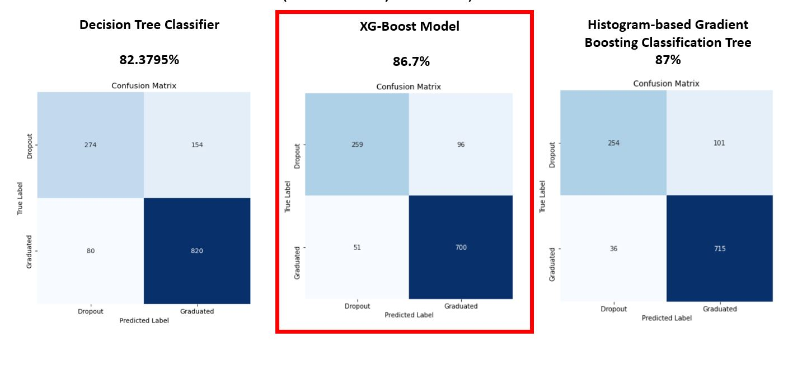

# eMergeEducation

The focus of this project is to contribute to the reduction of academic dropout and failure in higher education, by using machine learning techniques to identify students at risk at an early stage of their academic path, so that strategies to support them can be put into place. 

# Content

Within this repository you can find the data source we use to feed the models and make our predictions, which you can also download [here](https://archive.ics.uci.edu/dataset/697/predict+students+dropout+and+academic+success "here").
In addition, you will find a Jupyter notebook where the process that was carried out for the analysis of the dataset and the training of the models and a file containing the dictionary for the features.

# Summary

Education is a vital component for socioeconomic development of the individual, community and the country.Education affects employment  opportunities and ability to face the challenges of society.Education is extremely important for acquiring skills and knowledge essential for surviving in the current society and due to the fact many students who drop out or fail end up earning very low income, limiting their social and economic wellbeing and losing opportunities. Leaving school at an early stage leaves learners unprepared for the life situations making it hard for them to uplift their living conditions.

This project analyses the possible causes and factors responsible for dropout in schools and formulates models for classification and prediction of the students as the potential drop out from the school or not based on these factors.This models uses various  machine learning classification techniques and tries to find out the best possible technique for classification and prediction based on accuracy of results.

### Data Understanding

The dataset contains information gathered from multiple disconnected databases within a higher education institution, focusing on students enrolled in various undergraduate degree programs. The dataset includes information known at the time of student enrollment – academic path, demographics, and social-economic factors. 
The problem is formulated as a three category classification task (dropout, enrolled, and graduate) at the end of the normal duration of the course. 

According to the dataset providers, extensive data preprocessing was conducted to address anomalies, unexplainable outliers, and missing values. Despite this effort, certain transformations are still required to prepare the dataset for the next phase, which involves model-building.

Surprisingly, it was discovered that all columns containing categorical data are encoded using a non-linear scale. While the reason for this unconventional encoding remains unknown, the meanings of the numbers are now understood. Therefore, we have decided to convert the existing non-linear scale into a linear one to ensure better interpretability and compatibility with the upcoming modeling process.

After analyzing the different features we came to the conclusion that they are all important. Below is a table some of the 36 features:

|Name|Type|    
|----|-----|
|Marital status|int64|
|Application mode|int64|
|Admission grade|float64|
|Course|int64|
|Daytime/evening attendance|int64|
|Nacionality|int64|
|Gender|int64|
|Scholarship holder|int64|
|Age at enrollment|int64|
|Unemployment rate|float64|

Additionally, it also incorporates vital data on the students' academic performance at the end of the first and second semesters. The problem at hand is formulated as a three-category classification task, where the models are designed to predict three distinct outcomes for the students; we combined the enrolled class with the graduate class, given our business context and target since it would bring better insight and it helped balance our classes in a better way simultaneously.
 
The dataset contained over 3000 instances and realized that it was a low-complexity dataset, so from there we also chose punctual performance evaluation techniques that could help us have more reliable results such as cross-validation.

To have more details of each feature please check the features dictionary [here](link of the csv "here").

###  Data Modelling

There are different types of models for data classification problems. Each model has its own strengths and weaknesses in a given scenario. There is no cut-and-dried flowchart that can be used to determine which model you should use without grossly oversimplifying the considerations. Choosing a data classification model is also closely tied to the business case and a solid understanding of what you are trying to accomplish.

We decided to start with a decision tree, and scale it to XGBoost and end with Histogram-based Gradient Boosting Classification Tree to compare the accuracy score of each model and determine which would be the best for this project.

### Model Evaluation
After training the models we end up with these results for the accuracy score, having greater success with the Histogram-based Gradient Boosting Classification Tree model.

Upon examining our models, it became evident that XGBoost offers several advantages, with the most significant being its lower complexity. While Histogram Gradient Boosting achieved a marginally better accuracy, it came at the cost of higher complexity in terms of model structure and interpretability. The XGBoost model, on the other hand, provided comparable accuracy with much simpler and more transparent rules, making it easier to comprehend and maintain in production.

During our evaluation, we also discovered that XGBoost delivered more true positives and fewer false negatives compared to Histogram Gradient Boosting. This is a crucial factor, particularly in classification tasks where correctly identifying positive instances (true positives) and minimizing false negatives are of utmost importance. By reducing false negatives, XGBoost demonstrates higher sensitivity and is better equipped to correctly predict positive instances.

In summary, while Histogram Gradient Boosting exhibited a slightly higher accuracy, we confidently selected XGBoost as our preferred model due to its lower complexity, comparable accuracy, and superior performance in terms of true positives and false negatives. This decision ensures a more interpretable and efficient model that aligns with the specific requirements of our project, while maintaining a high level of predictive power and reliability.

### Conclusions

Our primary goal is not to utilize these predictive models as a means of admitting or rejecting students but to develop an assessment prioritization tool that helps institutions allocate resources effectively to support students who may be at risk of dropping out.

It is essential to stress that predictive models should never replace human judgment or decision-making. Instead, they should complement and inform the decision-making process. Our AI models should serve as an aid to identify students who might benefit from additional support, early interventions, or tailored resources. By doing so, we aim to foster an inclusive and supportive learning environment that maximizes the chances of student success and retention.

It is crucial for us to use AI responsibly, transparently, and with a strong focus on fairness. We must be cautious about introducing any biases into the models that could result in discriminatory outcomes or perpetuate existing inequalities. Regular audits of the model's performance and fairness should be conducted to ensure its predictions are equitable and unbiased.

Furthermore, human intervention plays a vital role in the process. The final decisions about how to allocate resources or provide support to individual students should be made by educators, counselors, and administrators who have a comprehensive understanding of the unique circumstances and needs of each student. The AI model's predictions should be considered as valuable insights, but the human element ensures that empathy, contextual understanding, and ethical considerations are taken into account when making decisions.

